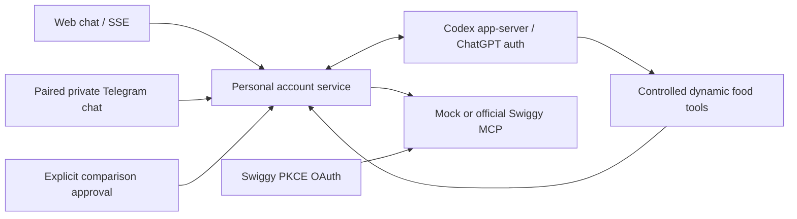

# Architecture

The React client and Telegram adapter call the same `FoodService`. A conversation tracks preferences, observed candidates, coverage and temporary approval state. The agent can update preferences, search, inspect offers, present a shortlist and request a comparison. It receives only controlled dynamic tools, with execution/editing/web tools disabled and unrelated approvals declined.

Candidate handles come from actual gateway responses. The application checks stock, restaurant availability, diet, budget, quantity and ETA, and rejects invented handles. Ingredient exclusions are name matching only, not verified ingredients or allergy advice. Missing availability data is excluded. Customizations are excluded from comparisons until their selection protocol is implemented.

The agent does not calculate trusted checkout prices. An approval expires after two minutes and binds frozen copies of the exact item plans, preferences, quantity, address and starting cart fingerprint. Comparing is serial for the account, snapshots `pricing.to_pay`, verifies coupon application and clears only the expected test cart. A changed cart stops the operation. Existing items need a separate explicit discard confirmation on web. There is no transactional lock over the external Swiggy app; a read/write race remains possible, so the user should leave that cart alone during comparison.

The MCP gateway retains a connection, paces conservative local request limits, and avoids retrying writes after errors. A comparison checks baseline plus up to three distinct eligible non-payment coupons per dish or bundle; it does not claim to exhaust every offer. Live comparison is disabled until staging validation. Visible payment offers are not treated as verified savings. Search and comparison coverage is bounded; full market enumeration is not promised.

Observed dishes can form one-restaurant bundles with exact per-line quantities. Backend guards reject nested/customized bundles, mixed restaurants and final per-item quantities above ten. Above-budget proposals require an explicit hypothesis flag; only `pricing.to_pay` establishes affordability. Trials verify all returned item IDs and quantities, and applied coupon codes, including fee reductions with zero item discount.

User directives are stored separately from chats through `DirectiveStore`, shared by both channels. Writes are serialized, deduplicated and encrypted with atomic replacement; the store caps at 30 entries. Agent tools remember explicit or inferred stable preferences and forget observed IDs. Settings provides manual controls. Directive text is preference data, not permission to override cart safeguards; known credential patterns are rejected. Codex refreshes context each turn.

Swiggy OAuth is separate from Codex sign-in. OAuth state and PKCE verifier are short-lived and single-use. Discovered auth endpoints must stay on the official authorization origin. Runtime credentials are encrypted in a restricted local directory; no credentials are returned to the LLM. Conversation messages are in process memory, with bounded history and idle expiry on new conversation creation.

The server is a personal single-owner service. Cookie sessions use HTTP-only cookies and CSRF checks; hosted configurations require an access token and HTTPS origin, including behind a localhost reverse proxy. Telegram ignores unpaired users and group chats. Future multi-user support requires separate provider sessions, Swiggy tokens, conversations and access control per user.
